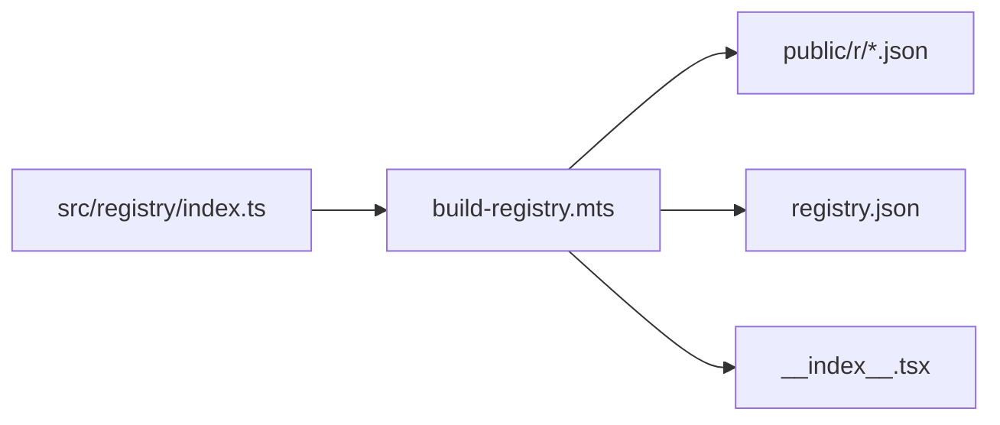

## Concise responses

- If you are not sure, STOP and ASK.
- In all interactions, and commit messages, be extremely concise. Sacrifice grammar for the sake of consicion.
- Avoid filler words and unnecessary repetition.

## Plans

- Make the plan extremely concise. Sacrifice grammar for the sake of concision.
- At the end of each plan, give me a list of unresolved questions to answer, if any.

### Multi-step plans

- Divide multi-step plans into phases, with different headings. That way, I can describe which phases I want to implement at a time so we don't have to implement everything at once.

## React

- Compose smaller components; avoid massive JSX blocks
- Colocate code that changes together
- Type components explicitly; avoid `forwardRef` (React 19 style)
- Avoid `useEffect` unless absolutely needed


# Shadcraft Registry

shadcn/ui-compatible registry of components, blocks, hooks, styles + preview UI.

## Project Structure

```
├── src/
│   ├── app/              # Next.js routes
│   │   ├── (app)/        # Main app layout
│   │   │   └── (registry)/ # Registry browsing pages
│   │   └── (view)/       # View registry items (previews only)
│   ├── components/       # Shared UI components
│   ├── config/           # App + registry config
│   ├── lib/              # Utilities (fonts, registry helpers)
│   ├── registry/         # Shadcraft registry (see src/registry/AGENTS.md)
│   ├── scripts/          # Build scripts
│   └── utils/            # Registry utilities
├── public/r/             # Generated registry JSON files (DO NOT EDIT)
└── registry.json         # Generated (DO NOT EDIT)
```



## Commands

| Cmd | Purpose |
|-----|---------|
| `pnpm dev` | Dev server |
| `pnpm build` | Full prod build (includes registry:build) |
| `pnpm registry:build` | Regen registry JSON files + `__index__.tsx` |

## See Also

- [REGISTRY.md](REGISTRY.md) — Full registry documentation
- [src/registry/AGENTS.md](src/registry/AGENTS.md) — Registry-specific guidance
